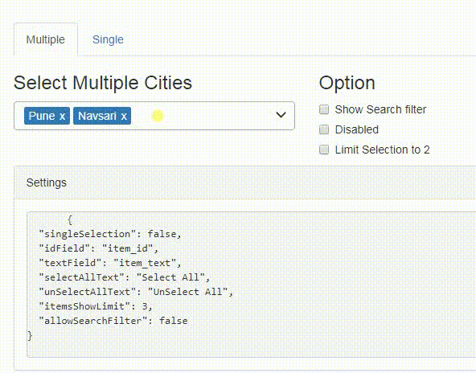

## Getting Started



### Dependencies
- Bootstrap 

## Features

- dropdown with single/multiple selction option
- search item with custom placeholder text
- limit selection
- select/de-select all items
 
### Installation
```
npm install ng-multiselect-dropdown`
```
And then include it in your module (see [app.module.ts](https://github.com/NileshPatel17/ng-multiselect-dropdown/blob/master/src/app/app.module.ts)):
```ts
import {NgMultiSelectDropDownModule} from 'ng-multiselect-dropdown';
// ...

@NgModule({
    imports: [
        NgMultiSelectDropDownModule.forRoot()
        // ...
    ]
    // ...
})

export class AppModule {}
```


### Usage
```
import { Component, OnInit } from '@angular/core';

export class AppComponent implements OnInit {
    dropdownList = [];
    selectedItems = [];
    dropdownSettings = {};
    ngOnInit(){
         this.cities = [
            { item_id: 1, item_text: 'Mumbai' },
            { item_id: 2, item_text: 'Bangalore' },
            { item_id: 3, item_text: 'Pune' },
            { item_id: 4, item_text: 'Navsari' },
            { item_id: 5, item_text: 'New Delhi' }
        ];
        this.selectedItems = [
            { item_id: 3, item_text: 'Pune' },
            { item_id: 4, item_text: 'Navsari' }
        ];
        this.dropdownSettings = {
            singleSelection: false,
            idField: 'item_id',
            textField: 'item_text',
            selectAllText: 'Select All',
            unSelectAllText: 'UnSelect All',
            itemsShowLimit: 3,
            allowSearchFilter: true
        };          
    }
    onItemSelect(item:any){
        console.log(item);
    }
    onSelectAll(items: any){
        console.log(items);
    }
}
```

```Markup
<ng-multiselect-dropdown
    [placeholder]="'custom placeholder'"
    [data]="items" 
    [(ngModel)]="selectedItems" 
    [settings]="dropdownSettings" 
    (onSelect)="onItemSelect($event)" 
    (onSelectAll)="onSelectAll($event)"
>
</ng-multiselect-dropdown>

```
### Settings

| Setting         |Type    | Description            | Default Value |
|:--- |:--- |:--- |:--- |
| singleSelection | Boolean | Mode of this component. If set `true` user can select more than one option. | false |
| placeholder | String | Text to be show in the dropdown, when no items are selected. | 'Select' |
| disabled | Boolean | Disable the dropdown | false |
| data | Array<any> | Array of items from which to select. Should be an array of objects with id and `text` properties. You can also use custom properties. In that case you need to map idField and `textField` properties. As convenience, you may also pass an array of strings, in which case the same string is used for both the ID and the text(no mapping is required) | n/a |
| idField | String | map id field in case of custom array of object | 'id' |
| textField | String | map text field in case of custom array of object | 'text' |
| enableCheckAll | Boolean | Enable the option to select all items in list | false |
| selectAllText | String | Text to display as the label of select all option | Select All |
| unSelectAllText | String | Text to display as the label of unSelect option | UnSelect All |
| allowSearchFilter | Boolean | Enable filter option for the list. | false |
| maxHeight | Number | Set maximum height of the dropdown list in px. | 197 |
| itemsShowLimit | Number | Limit the number of items to show in the input field. If not set will show all selected. | All |
| limitSelection | Number | Limit the selection of number of items from the dropdown list. Once the limit is reached, all unselected items gets disabled. | none |
| searchPlaceholderText | String | Custom text for the search placeholder text. Default value would be 'Search' | 'Search' |
| closeDropDownOnSelection | Boolean | Closes the dropdown when item is selected. applicable only in cas of single selection | false |

### Callback Methods
- `onSelect` - Return the selected item on selection.
    Example : (onSelect)="onItemSelect($event)"
- `onSelectAll` - Return the list of all selected items.
    Example : (onSelectAll)="onSelectAll($event)"
    

## Run locally
- Clone the repository or downlod the .zip,.tar files.
- Run `npm install`
- Run `ng serve` for a dev server
- Navigate to `http://localhost:4200/`

## License
MIT License.