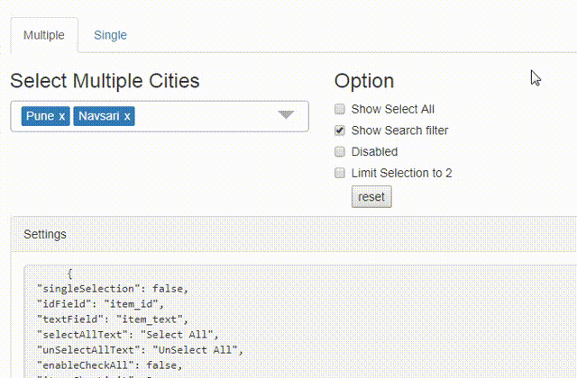

# Angular Multiselect Dropdown

[](https://www.npmjs.com/package/ng-multiselect-dropdown)
[](https://www.npmjs.com/package/ng-multiselect-dropdown)
[](https://www.npmjs.com/package/ng-multiselect-dropdown)

Angular multiselect dropdown component for web applications. Easy to integrate and use. It can be bind to any custom data source.

# [Demo](https://nileshpatel17.github.io/ng-multiselect-dropdown/)



## Getting Started

## Features

- dropdown with single/multiple selction option
- bind to any custom data source
- search item with custom placeholder text
- limit selection
- select/de-select all items

### Installation

```
npm install ng-multiselect-dropdown
```

And then include it in your module (see [app.module.ts](https://github.com/NileshPatel17/ng-multiselect-dropdown/blob/master/src/app/app.module.ts)):

```ts
import { NgMultiSelectDropDownModule } from 'ng-multiselect-dropdown';
// ...

@NgModule({
  imports: [
    NgMultiSelectDropDownModule.forRoot()
    // ...
  ]
  // ...
})
export class AppModule {}
```

### Usage

```ts
import { Component, OnInit } from '@angular/core';
import { IDropdownSettings } from 'ng-multiselect-dropdown';

export class AppComponent implements OnInit {
  dropdownList = [];
  selectedItems = [];
  dropdownSettings = {};
  ngOnInit() {
    this.dropdownList = [
      { item_id: 1, item_text: 'Mumbai' },
      { item_id: 2, item_text: 'Bangaluru' },
      { item_id: 3, item_text: 'Pune' },
      { item_id: 4, item_text: 'Navsari' },
      { item_id: 5, item_text: 'New Delhi' }
    ];
    this.selectedItems = [
      { item_id: 3, item_text: 'Pune' },
      { item_id: 4, item_text: 'Navsari' }
    ];
    this.dropdownSettings:IDropdownSettings = {
      singleSelection: false,
      idField: 'item_id',
      textField: 'item_text',
      selectAllText: 'Select All',
      unSelectAllText: 'UnSelect All',
      itemsShowLimit: 3,
      allowSearchFilter: true
    };
  }
  onItemSelect(item: any) {
    console.log(item);
  }
  onSelectAll(items: any) {
    console.log(items);
  }
}
```

```html
<ng-multiselect-dropdown
  [placeholder]="'custom placeholder'"
  [data]="dropdownList"
  [(ngModel)]="selectedItems"
  [settings]="dropdownSettings"
  (onSelect)="onItemSelect($event)"
  (onSelectAll)="onSelectAll($event)"
>
</ng-multiselect-dropdown>
```

### Settings

| Setting                        | Type       | Description                                                                                                                                                                                                                                                                                                                                              | Default Value       |
| :----------------------------- | :--------- | :------------------------------------------------------------------------------------------------------------------------------------------------------------------------------------------------------------------------------------------------------------------------------------------------------------------------------------------------------- | :------------------ |
| singleSelection                | Boolean    | Mode of this component. If set `true` user can select more than one option.                                                                                                                                                                                                                                                                              | false               |
| placeholder                    | String     | Text to be show in the dropdown, when no items are selected.                                                                                                                                                                                                                                                                                             | 'Select'            |
| disabled                       | Boolean    | Disable the dropdown                                                                                                                                                                                                                                                                                                                                     | false               |
| data                           | Array<any> | Array of items from which to select. Should be an array of objects with id and `text` properties. You can also use custom properties. In that case you need to map idField and `textField` properties. As convenience, you may also pass an array of strings, in which case the same string is used for both the ID and the text(no mapping is required) | n/a                 |
| idField                        | String     | map id field in case of custom array of object                                                                                                                                                                                                                                                                                                           | 'id'                |
| textField                      | String     | map text field in case of custom array of object                                                                                                                                                                                                                                                                                                         | 'text'              |
| enableCheckAll                 | Boolean    | Enable the option to select all items in list                                                                                                                                                                                                                                                                                                            | false               |
| selectAllText                  | String     | Text to display as the label of select all option                                                                                                                                                                                                                                                                                                        | Select All          |
| unSelectAllText                | String     | Text to display as the label of unSelect option                                                                                                                                                                                                                                                                                                          | UnSelect All        |
| allowSearchFilter              | Boolean    | Enable filter option for the list.                                                                                                                                                                                                                                                                                                                       | false               |
| searchPlaceholderText          | String     | custom search placeholder                                                                                                                                                                                                                                                                                                                                | Search              |
| clearSearchFilter              | Boolean    | clear search filter on dropdown close                                                                                                                                                                                                                                                                                                                    | true                |
| maxHeight                      | Number     | Set maximum height of the dropdown list in px.                                                                                                                                                                                                                                                                                                           | 197                 |
| itemsShowLimit                 | Number     | Limit the number of items to show in the input field. If not set will show all selected.                                                                                                                                                                                                                                                                 | All                 |
| limitSelection                 | Number     | Limit the selection of number of items from the dropdown list. Once the limit is reached, all unselected items gets disabled.                                                                                                                                                                                                                            | none                |
| searchPlaceholderText          | String     | Custom text for the search placeholder text. Default value would be 'Search'                                                                                                                                                                                                                                                                             | 'Search'            |
| noDataAvailablePlaceholderText | String     | Custom text when no data is available.                                                                                                                                                                                                                                                                                                                   | 'No data available' |
| closeDropDownOnSelection       | Boolean    | Closes the dropdown when item is selected. applicable only in cas of single selection                                                                                                                                                                                                                                                                    | false               |
| defaultOpen                    | Boolean    | open state of dropdown                                                                                                                                                                                                                                                                                                                                   | false               |

### Callback Methods

- `onSelect` - Return the selected item when an item is checked.
  Example : (onSelect)="onItemSelect($event)"
- `onSelectAll` - Return the all items.
  Example : (onSelectAll)="onSelectAll($event)".
- `onDeSelect` - Return the unselected item when an item is unchecked.
  Example : (onDeSelect)="onItemDeSelect($event)"
- `onFilterChange` - Return the key press.
  Example : (onFilterChange)="onFilterChange($event)"
- `onDropDownClose`-
  Example : (onDropDownClose)="onDropDownClose()"

## Run locally

- Clone the repository or downlod the .zip,.tar files.
- Run `npm install`
- Run `ng serve` for a dev server
- Navigate to `http://localhost:4200/`

## Library Build / NPM Package

Run `yarn build:lib` to build the library and generate an NPM package. The build artifacts will be stored in the dist-lib/ folder.

## Running unit tests

Run `yarn test` to execute the unit tests.

## Development

This project was generated with Angular CLI version 1.7.1.

## Contributions

Contributions are welcome, please open an issue and preferrably file a pull request.

### Opening Issue

Please share sample code using codesandbox.com or stackblitz.com to help me re-produce the issue.

## License

MIT License.
