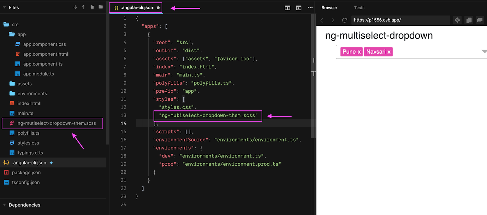

# Custom Theme

#### Step 1:

1. copy 'ng-multiselect-dropdown.theme.scss' file located at `node_modules\ng-multiselet-dropdown\themes\ng-multiselect-dropdown.theme.scss`

** if you are using version below 0.2.11, you need to get it from https://github.com/NileshPatel17/ng-multiselect-dropdown/themes/ng-multiselet-dropdown.theme.css

#### Step 2:
1. paste this file in your project wherever you want. Include this file `ng-multiselet-dropdown.theme.css` in `angular-cli.json` (for versions below angular 6) and `angular.json` (for version 6 or more). file name can be anything.

#### Step 3:
1. Change $base-color in 'ng-multiselect-dropdown.theme.scss'

### You can also checkout [sample code](https://codesandbox.io/s/custom-theme-p1556), i created in codesandbox.